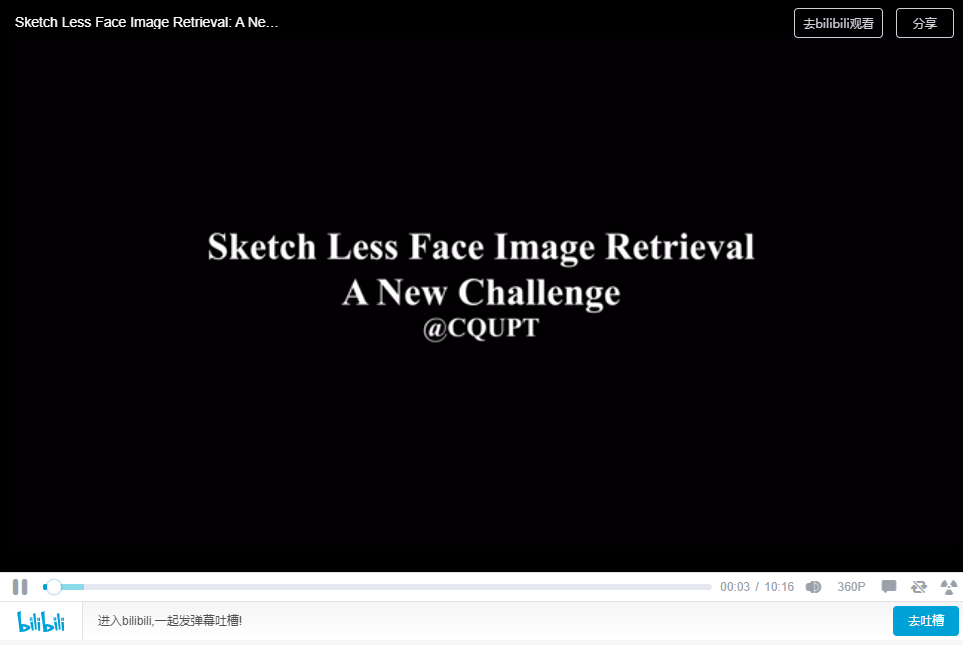
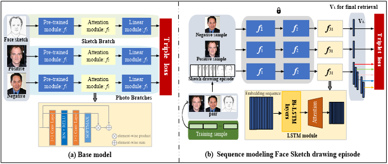
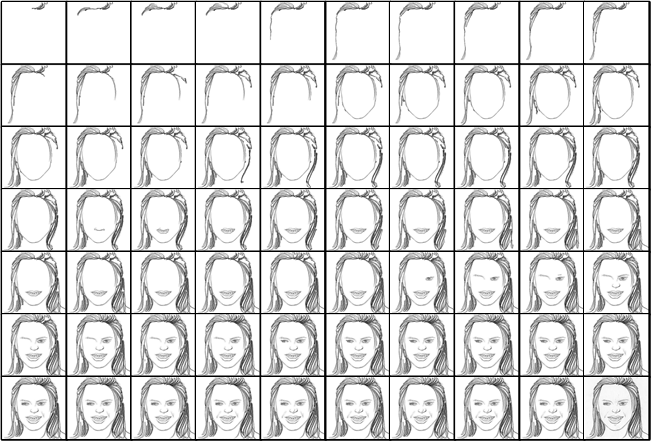

# Sketch Less Face Image Retrieval: A New Challenge

<iframe height=640 width=480 src="//player.bilibili.com/player.html?aid=561883674&bvid=BV1be4y1e7WA&cid=871667072&page=1" scrolling="no" border="0" frameborder="no" framespacing="0" allowfullscreen="true"> </iframe>

**This repository is the official pytorch implementation of our paper, \*Sketch Less Face Image Retrieval: A New Challenge\*.**

## 🌟 Pipeline

## :floppy_disk: Dataset

### Please click on the link [FS2K-SDE](https://github.com/ddw2AIGROUP2CQUPT/FS2K-SDE) for the dataset.

## ⏳ To Do

- [ ] Release training code

- [ ] Release testing code
- [ ] Release pre-trained models

## 📔 Citation

coming soon......

## 💡 Acknowledgments

*We would like to thank all of reviewers for their constructive comments and CQUPT for supporting.*

## 📨 Contact

This repo is currently maintained by Dawei Dai (dw_dai@163.com) and his master's student Yutang Li (2018211556@stu.cqupt.edu.cn).
